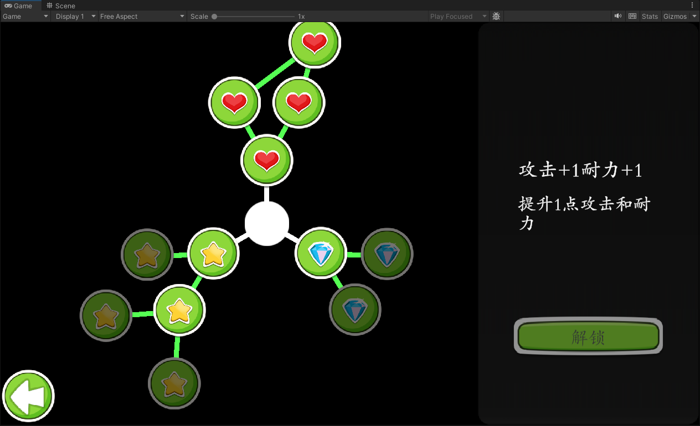
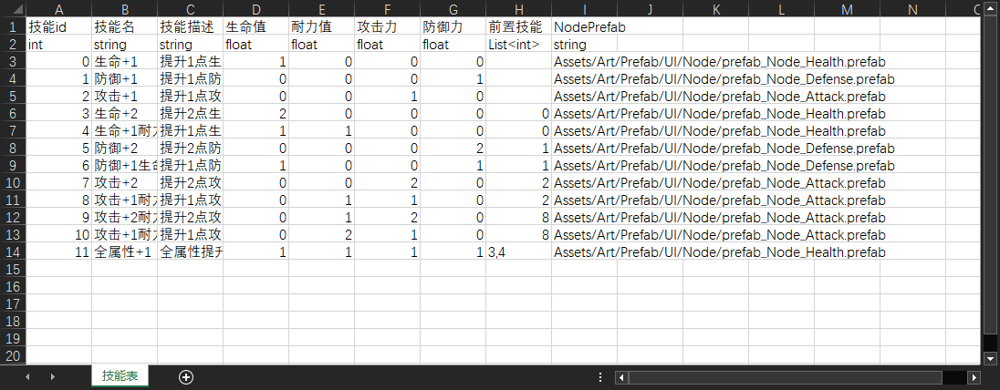

# 技能树 UI Demo

这是一个 Unity 技能树 UI Demo，目标是用一张 CSV 配置表驱动技能数据、运行时解锁逻辑、角色属性变化，并在编辑器中一键重建技能树 UI。



项目主要包含四套系统：

1. 基础 UI 面板管理与对象池
2. CSV 导表与运行时二进制表读取
3. 技能树数据、解锁与属性加成
4. 技能树 UI 自动构建与交互展示

## 快速使用

1. 准备技能 CSV。首行为表头，第二行为类型，第三行开始为数据。
2. 在 Unity 菜单执行 `Tools/Export Sheet/导表...`，选择 CSV，导出到 `Assets/Resources/Sheets/{表名}.bytes`。
3. 选中 `Assets/Resources/UI/Skill/SkillGraphPanel.prefab`，在 Inspector 点击 `选择技能表 .bytes 并重建 SkillGraphPanel`。
4. 运行场景。`Storyline` 会打开起始 UI，技能树面板从 `Resources/UI/Skill/SkillGraphPanel` 加载，点击节点可查看描述并解锁技能。

可直接运行的示例场景位于 `Assets/Scenes/SampleScene.unity`。

演示视频：

- [编辑器自动创建技能树 UI 演示](DemoVideo/编辑器自动创建技能树UI演示.mp4)
- [运行时完整演示](DemoVideo/运行时完整演示.mp4)

技能表当前使用 `Resources.Load<TextAsset>("Sheets/技能表")` 读取，因此默认技能表文件应为：

```text
Assets/Resources/Sheets/技能表.bytes
```

## 表格格式

导表系统支持 CSV，表头在第一行，类型行在第二行。类型支持 `int`、`float`、`double`、`bool`、`string` 和 `List<T>` 形式；CSV 解析支持引号字段、引号内换行、`""` 转义，并兼容 UTF-8、带 BOM 文本和 Windows 中文环境常见的 GBK 编码。

项目里的源表格文件示例放在 `Assets/Sheets/`：

- `Assets/Sheets/技能表.csv`：技能树数据源表。
- `Assets/Sheets/初始属性表.csv`：角色初始属性数据源表。

技能表必要列：

| 列名 | 类型 | 用途 |
| --- | --- | --- |
| `技能id` | `int` | 技能唯一 ID |
| `技能名` | `string` | 节点显示名和详情标题 |
| `技能描述` | `string` | 技能详情文本 |
| `生命值` | `float`/`double` | 解锁后增加的生命值 |
| `耐力值` | `float`/`double` | 解锁后增加的耐力值 |
| `攻击力` | `float`/`double` | 解锁后增加的攻击力 |
| `防御力` | `float`/`double` | 解锁后增加的防御力 |
| `前置技能` | `List<int>` | 解锁前置技能 ID 列表，空表示根节点 |

编辑器重建技能树时还会读取可选列 `NodePrefab`。该列可以为某个技能指定节点 prefab 路径；为空或无效时使用默认节点 prefab。

技能表源数据示例：



## 基础 UI 系统

### UIController

`UIController` 是简单的 UI 栈管理器，负责面板切换：

- `CreatePanel(path)`：隐藏当前面板，将当前面板路径压栈，然后从对象池创建或复用新面板。
- `PopPanel()`：关闭当前面板，并从栈中恢复上一个面板。

`NextPanelButton` 通过配置 `nextPanelPath` 打开下一级面板，`BackButton` 调用 `PopPanel()` 返回上一层。`Storyline` 在场景启动时默认打开 `UI/MenuPanel`。

### UIPanelPool

`UIPanelPool` 负责按 Resources 路径加载、创建、复用和延迟销毁 UI 面板。

核心设计是「两层循环链表 + 分帧扫描 + 引用计数句柄」。

Pool 内部维护两层可回收对象：

- 第一层是 `UIPrefabChain`，管理不同 UI prefab。它按 `path` 缓存 `UIPrefabElement`，并用循环链表逐个扫描 prefab 是否已经没有实例、是否可以释放 prefab 引用。
- 第二层是每个 `UIPrefabElement` 自己的 `UIPanelInstanceChain`，管理该 prefab 创建出来的无引用 instance。它也用循环链表逐个扫描 instance 是否闲置超时、是否可以销毁 GameObject。

循环链表和扫描回收机制是绑定在一起的。每条链都有一个 `current` 指针，`Update()` 中不会一次性扫完整个池，而是从 `current` 开始，只处理少量节点，然后把 `current` 推进到下一个节点。这样回收成本被摊到多帧，不会因为一次关闭很多 UI 而集中卡顿。

扫描发现的无引用 instance的 `discardTime` 超过 5 秒后销毁 GameObject；某个 prefab 的实例全部销毁后，prefab 自己也开始累计 `discardTime`，超过 5 秒后移除 prefab 引用。

插入新节点时，Pool 会把新对象放到扫描队列的尾部，也就是 `current` 的前一位；从扫描顺序看，相当于放在当前扫描游标后方。这样新插入的 prefab 或 instance 不会立刻被当前帧扫到，而是等扫描游标绕一圈之后才进入回收判断，避免“刚放回池里就被扫描销毁”的情况。

外部系统不直接管理 UIPanel 的完整生命周期。`UIController` 只负责打开、关闭、返回上一级面板；真正的加载、复用、回收、延迟销毁都由 `UIPanelPool` 统一决定。外部拿到的是 `UIPanelHandle`，它负责引用计数：

对象池还会对全屏拉伸 UI 做一次 RectTransform 归一化：实例化或复用时使用 `SetParent(pool.transform, false)`，并将全屏根节点的 `offsetMin`、`offsetMax`、`anchoredPosition` 归零，避免面板复用后出现半屏或偏移问题。

## 导表系统

### ExportSheet

`ExportSheet` 是编辑器侧 CSV 读取器，负责：

- 解析表头、类型行和数据行。
- 支持逗号分隔 CSV，以及带引号的字段、换行和转义。
- 自动处理常见文本编码。
- 提供 `TryGetCellAsInt`、`TryGetCellAsFloat`、`TryGetCellAsListInt` 等类型读取接口。

### SheetBinaryExporter

`SheetBinaryExporter` 将 `ExportSheet` 写成紧凑二进制 `.bytes` 文件。导出的文件包含 magic、版本号、表名、表头、类型行和所有数据行。

### SheetTableBin

`SheetTableBin` 是运行时表数据对象，由 `Resources.Load<TextAsset>` 加载 `.bytes` 后解析。运行时系统不再直接读取 CSV，而是读取 `Assets/Resources/Sheets/*.bytes`，减少解析成本并统一数据格式。

## 技能树系统

技能树系统分为运行时数据层和 UI 表现层。

`SkillGraphManager` 负责管理运行时技能数据，包括技能表读取、依赖关系校验、解锁条件、解锁状态和属性加成；

`SkillGraphPanel`、`SkillNode`、`SkillDescription` 则是 UI 功能组件，负责技能树界面构建、节点点击、详情展示、按钮状态和视觉同步。

### SkillGraphManager

`SkillGraphManager` 是技能树运行时数据中心，挂在 `Assets/PlayerData.prefab` 上，并继承 `SingletonBehaviour<SkillGraphManager>`。

它负责：

- 启动时读取 `Resources/Sheets/技能表.bytes`。
- 校验技能表必要列、技能 ID 唯一性、前置技能是否存在、依赖图是否有环。
- 构建 `SkillState` 字典，记录技能表数据、层级深度和是否已解锁。
- 提供 `IsSkillUnlocked(skillId)` 和 `TryUnlockSkill(skillId)`。
- 解锁成功后调用 `PlayerAttributes.Instance.FetchAttributeChange(...)` 应用属性加成。

当前 Demo 中解锁状态保存在运行时内存里；如果需要正式存档，可以在 `SkillGraphManager` 的 `SkillStates` 基础上接入本地存档或账号数据。

### SkillGraphPanel

`SkillGraphPanel` 是技能树面板脚本，挂在 `Assets/Resources/UI/Skill/SkillGraphPanel.prefab`。

编辑器职责：

- 从 `.bytes` 技能表重建技能树节点。
- 使用 GIGA Auto Radial Layout 的 `RadialLayout`、`RadialLayoutNode` 和 `RadialLayoutLink` 自动排布技能节点和连线。
- 按技能依赖深度排序节点，拥有多个前置技能时添加合流节点组件。
- 支持通过 `NodePrefab` 列为不同技能使用不同节点 prefab。

运行时职责：

- 收集面板中的 `SkillNode`。
- 从 `SkillGraphManager.SkillStates` 绑定技能名称、描述、属性加成和前置技能。
- 同步节点锁定/解锁视觉。
- 点击节点时刷新右侧技能描述。
- 点击解锁按钮时调用 `SkillGraphManager.TryUnlockSkill`，成功后更新节点和连线高亮。

### SkillNode

`SkillNode` 表示一个技能节点：

- 保存技能 ID、绑定后的技能名、描述、属性加成和前置技能。
- 点击时通知父级 `SkillGraphPanel`。
- `SetUnlockedVisual(bool)` 只更新视觉状态，不产生属性加成副作用。
- 视觉默认通过 Image 颜色表现锁定和解锁状态。

### SkillDescription

`SkillDescription` 负责技能详情区域：

- `skillNameText` 显示技能名。
- `skillDescriptionText` 显示技能描述。
- `unlockButton` 由 `SkillGraphPanel` 控制是否可点击。

## 属性系统

`PlayerAttributes` 继承 `SingletonBehaviour<PlayerAttributes>`，同样挂在 `PlayerData.prefab` 上。它会读取：

```text
Assets/Resources/Sheets/初始属性表.bytes
```

运行时流程：

- `Start()` 加载初始属性表，构建属性字典。
- 属性由基础值和技能加成值组成。
- 技能解锁后，`SkillGraphManager` 调用 `FetchAttributeChange` 叠加技能加成。
- `AttriLinesList` 在属性面板启用时注册到 `PlayerAttributes`，并刷新所有 `AttriLine` 显示。

## 关键资源路径

| 路径 | 说明 |
| --- | --- |
| `Assets/Resources/UI/MenuPanel.prefab` | 起始菜单面板 |
| `Assets/Resources/UI/AttributePanel.prefab` | 属性展示面板 |
| `Assets/Resources/UI/Skill/SkillGraphPanel.prefab` | 技能树面板 |
| `Assets/Resources/Sheets/技能表.bytes` | 运行时技能表 |
| `Assets/Resources/Sheets/初始属性表.bytes` | 运行时初始属性表 |
| `Assets/PlayerData.prefab` | 持久化数据对象，包含技能树和属性管理组件 |
| `Assets/Art/Prefab/UI/Node/*.prefab` | 技能节点视觉 prefab |
| `Assets/GIGA Softworks/Auto Radial Layout` | 技能树自动布局依赖 |

## 主要脚本索引

| 脚本 | 功能 |
| --- | --- |
| `Assets/Scripts/UIController.cs` | UI 栈与面板切换 |
| `Assets/Scripts/UIPanelPool.cs` | UI 面板对象池、复用和延迟销毁 |
| `Assets/Scripts/Storyline.cs` | Demo 启动入口，打开起始 UI |
| `Assets/Scripts/ExportSheet/Editor/ExportSheet.cs` | CSV 解析 |
| `Assets/Scripts/ExportSheet/Editor/SheetBinaryExporter.cs` | CSV 到 `.bytes` 导出 |
| `Assets/Scripts/ExportSheet/Editor/ExportSheetMenu.cs` | Unity 导表菜单 |
| `Assets/Scripts/ExportSheet/Runtime/SheetTableBin.cs` | 运行时二进制表读取 |
| `Assets/Scripts/UI/Skill/SkillGraphManager.cs` | 技能数据、解锁状态和属性加成 |
| `Assets/Scripts/UI/Skill/SkillGraphPanel.cs` | 技能树 UI 交互与编辑器重建 |
| `Assets/Scripts/UI/Skill/SkillNode.cs` | 单个技能节点 |
| `Assets/Scripts/UI/Skill/SkillDescription.cs` | 技能详情 UI |
| `Assets/Scripts/UI/Skill/Editor/SkillGraphPanelEditor.cs` | Inspector 重建按钮 |
| `Assets/Scripts/PlayerAttributes.cs` | 角色属性数据 |
| `Assets/Scripts/UI/AttriLinesList.cs` | 属性 UI 列表 |
| `Assets/Scripts/UI/AttriLine.cs` | 单条属性显示 |